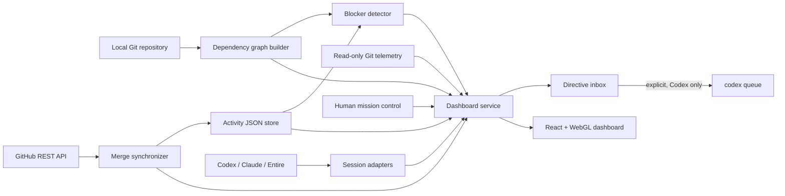

# Spidey Sense — Complete Project Context and Fresh-Build Specification

This document is designed to be pasted into another AI coding tool as the complete
context for rebuilding the project from an empty repository. It describes the
product intent, current implementation, architecture, features, data contracts,
algorithms, UI, security boundaries, verification strategy, limitations, and a
recommended build sequence.

> **Architecture checkpoint:** The repository has since aligned this local
> foundation with a shared team platform. Read
> [`docs/checkpoints/CP-001-architecture-foundation.md`](docs/checkpoints/CP-001-architecture-foundation.md)
> together with this document. CP-001 defines team joining, plans and assignments,
> the local connector, shared control plane, GitHub App direction, live collaboration,
> conflict incidents, original spider-themed personas, and the `progress` -> `main`
> checkpoint workflow.

## 1. Project identity

- **Product name:** Spidey Sense
- **Current version:** 0.7.0
- **License:** MIT
- **Repository:** `Preethesh16/Spidey-Sense`
- **Category:** Local-first developer coordination and dependency-risk dashboard
- **Primary use case:** Teams running multiple human developers or AI coding agents
  against the same Git repository at the same time
- **Short description:** A dependency-aware coordination radar that shows who is
  working on which files, detects likely collisions before merge time, and renders
  the repository and active work as an interactive 3D dependency web.

The workspace folder may be called `Track Builder`, but the actual product in this
repository is **Spidey Sense**.

## 2. The problem being solved

Developers increasingly run Codex, Claude Code, Entire, and other coding agents in
parallel. Each session may appear safe alone, but two sessions can unknowingly:

- edit the same file;
- edit files connected by an import/dependency relationship;
- duplicate work;
- depend on code that another active session is changing;
- continue work that has already been merged;
- operate without a shared view of current assignments and repository state.

Traditional Git tooling usually reveals these problems at commit, rebase, pull
request, or merge time. Spidey Sense is intended to provide an earlier warning.

## 3. Product vision

Spidey Sense turns a codebase into a live, navigable coordination map. It combines:

1. the repository's real file dependency graph;
2. explicit file assignments and statuses for teammates;
3. derived same-file and dependency blockers;
4. local Git branch, commit, and worktree telemetry;
5. public session metadata from supported AI coding tools;
6. optional GitHub merged-pull-request data;
7. human-created instructions for active agents.

The system should help answer five questions quickly:

- Where is work happening?
- Who or which agent is doing it?
- What file relationships make that work risky?
- What has recently changed or merged?
- What should a human assign or tell an agent next?

## 4. Core product principles

### Local-first

Repository source, file paths, teammate names, activity, directives, and telemetry
stay on the developer's machine. The current application needs no hosted backend.
Only the optional GitHub integration requires internet access.

### Explainable warnings

Every warning must trace to concrete evidence:

- a shared file; or
- a resolved directed dependency edge.

The UI must not invent vague AI risk scores that cannot be explained.

### File-level common model

Files are the shared unit across imports, Git, pull requests, agent activity, and
manual assignments. Future symbol-level graph providers may enrich this model, but
the file-level fallback must continue to work without extra services.

### Modular JSON boundaries

The graph builder, activity store, blocker detector, GitHub adapter, telemetry
collector, directive inbox, dashboard API, and frontend are separate modules. Each
major boundary accepts or emits versioned JSON so components can be replaced.

### Safe human control

Human instructions are stored as data in an auditable inbox. Direct sending is
explicit and allowlisted. The dashboard is not a general-purpose terminal.

## 5. Target users and user stories

### Target users

- individual developers running several AI coding sessions;
- small engineering teams coordinating humans and agents;
- technical leads supervising parallel tasks in one repository;
- teams that need a visual demonstration of repository activity and conflicts.

### Main user stories

- As a developer, I can scan a Git repository and receive a deterministic file
  dependency graph.
- As a team lead, I can assign one or more files to a teammate and mark the work
  pending, working, or done.
- As a teammate, I can see when another active teammate is editing the same file.
- As a teammate, I can see when my active file depends on a file another teammate
  is changing.
- As a lead, I can view the codebase as directory zones, file nodes, and dependency
  strands in 3D.
- As a lead, I can see current Git changes and recent commits without modifying Git.
- As a lead, I can discover public session information from installed Codex, Claude
  Code, and Entire CLIs.
- As a lead, I can queue an instruction for an agent or explicitly send one to a
  known Codex task.
- As a team, we can synchronize merged GitHub pull requests and safely mark matching
  active work complete.

## 6. Terminology and visual language

The stored data uses ordinary engineering names. The UI adds a Spidey Sense themed
presentation layer without changing JSON contracts.

| UI term | Engineering meaning |
| --- | --- |
| Web Zone | Top-level directory or source area |
| Web Node | Repository source file |
| Strand | Resolved directed import/dependency edge |
| Web Runner | Teammate or discovered AI CLI session |
| Mission | File assignment with a status |
| Web Signal | Human directive for a runner |
| Tangle / Danger Signal | Same-file collision or dependency blocker |
| Timeline Pulse | Git commits, branch state, dirty files, and GitHub merges |
| Queued | Stored status `pending` |
| On mission | Stored status `working` |
| Secured | Stored status `done` |

The design is an original abstract night-radar interface. It must not use superhero
characters, movie imagery, third-party logos, or copied game artwork. The visual
palette is deep navy, cobalt blue, warning red, emerald, amber, and purple.

## 7. Technology stack

### Backend and CLI

- Python 3.10+
- Python standard library only at runtime
- `setuptools` build backend
- `argparse` for CLIs
- `http.server.ThreadingHTTPServer` for the local service
- `urllib` for GitHub REST requests
- `subprocess` for Git and documented AI CLI integrations
- `ast` for Python import parsing
- regular expressions plus comment masking for JavaScript/TypeScript imports
- JSON files for current state
- POSIX `fcntl` locks when available
- atomic temporary-file replacement for writes

### Frontend

- React 19
- TypeScript
- Vite
- Tailwind CSS 4
- React Three Fiber
- Drei helpers
- Three.js
- Radix UI Tooltip
- `clsx` and `tailwind-merge`
- Vitest, Testing Library, and jsdom

### Tooling and CI

- Python `unittest`
- npm scripts for test, typecheck, and build
- GitHub Actions
- Node.js 20 in CI
- Python 3.12 in CI

## 8. High-level architecture



Runtime flow:

1. The graph engine locates the Git root and scans tracked plus non-ignored untracked
   supported source files.
2. A teammate or dashboard action writes the current assignment to the activity
   JSON store.
3. On every dashboard refresh, the service builds or loads the graph, reads current
   activity, and calculates blockers.
4. The service also reads Git state, discovers supported CLI sessions, reads the
   directive inbox, and optionally loads the latest GitHub sync result.
5. One aggregate JSON payload is returned to the React client.
6. The client polls every three seconds while the page is visible.
7. The UI renders summary metrics, the 3D dependency web, active sessions, mission
   forms, mission pathways, blockers, Git history, GitHub merge data, and directives.

## 9. Repository layout

```text
spidey_sense/
  __main__.py              Package entry point for graph CLI
  cli.py                   Dependency graph command
  graph.py                 JS/TS/Python dependency graph engine
  activity/
    store.py               Atomic current-state teammate store
    cli.py                 set/status/get/list/remove commands
  blockers/
    detector.py            Same-file and directed dependency collision logic
    cli.py                 Graph + activity blocker command
  github/
    client.py              Dependency-free GitHub REST client
    sync.py                Merge-to-activity synchronization
    cli.py                 GitHub sync command
  live/
    telemetry.py           Git, Codex, Claude, and Entire observations
    directives.py          Atomic directive inbox and Codex dispatcher
    cli.py                 snapshot/inbox/send/ack commands
  dashboard/
    server.py              Aggregate service, REST endpoints, static serving
    __main__.py            Dashboard module entry point
frontend/
  src/
    App.tsx                Fetching, polling, mutation and error states
    DashboardView.tsx      Main dashboard shell and summary panels
    types.ts               TypeScript API contracts
    styles.css             Tailwind import and custom radar design
    components/
      DependencyWorld.tsx  3D graph layout and interactions
      MissionControl.tsx   Agent radar, assignment, directives, Git pulse
      StatusPath.tsx       Queued/working/done path and blocker tooltip
    test/fixtures.ts       Representative aggregate payload
  vite.config.ts           Build config and local API proxy
  vitest.config.ts         jsdom test config
tests/                     Python unit and integration tests
examples/                  Demo activity and GitHub sync JSON
docs/                      Architecture, contracts, design, integrations, roadmap
.github/workflows/ci.yml   Backend and frontend CI jobs
```

## 10. Feature set in detail

### 10.1 Dependency graph builder

The graph engine accepts a path inside a local Git repository and returns a
deterministic file-level graph.

Supported file extensions:

- JavaScript: `.js`, `.jsx`, `.mjs`, `.cjs`
- TypeScript: `.ts`, `.tsx`, `.mts`, `.cts`
- Python: `.py`, `.pyi`

Scan rules:

- Resolve the actual repository root using `git rev-parse --show-toplevel`.
- Ask Git for cached and non-ignored untracked files using `git ls-files`.
- Exclude ignored files, missing files, symlinks, and unsupported extensions.
- Normalize paths to repository-relative POSIX strings.
- Sort files and output deterministically.

JavaScript/TypeScript parsing recognizes:

- static `import` statements;
- type imports;
- side-effect imports;
- re-exports;
- dynamic `import()` calls;
- CommonJS `require()` calls.

The parser masks line and block comments while preserving strings and line offsets.
It is intentionally lightweight rather than a complete JavaScript AST parser.

JavaScript/TypeScript resolution supports:

- relative imports only;
- query/hash suffix removal;
- exact paths;
- common extension substitution;
- extensionless imports;
- directory `index` modules;
- `package.json` `types`, `module`, and `main` entries.

Python parsing uses the standard-library AST and recognizes:

- absolute imports;
- `from x import y` imports;
- relative imports;
- package `__init__` modules;
- common repository roots: root, `src/`, `python/`, and `lib/`.

Graph behavior:

- An edge is directed from importer to dependency: `source -> target`.
- Only imports that resolve to supported files inside the repository become edges.
- External packages and unresolved local-looking imports become informational
  diagnostics for JavaScript/TypeScript.
- Python syntax errors become error diagnostics instead of stopping the scan.
- Duplicate edges are removed.
- Every edge keeps kind, original specifier, and source line.

### 10.2 Activity tracker

The activity tracker stores the latest complete record for each teammate. It is a
current-state coordination store, not an event history.

Each activity record has:

- teammate display name;
- one or more repository-relative file paths;
- status: `pending`, `working`, or `done`;
- UTC `updated_at` timestamp.

Operations:

- create or replace a teammate record;
- update only its status while retaining its files;
- fetch one record;
- list the complete store;
- remove a record;
- compare-and-set a status only if timestamp and files are unchanged.

Validation and normalization:

- teammate name must be non-empty, single-line text;
- file paths are trimmed and backslashes become `/`;
- absolute paths, Windows drive paths, NUL bytes, and `..` traversal are rejected;
- duplicate file entries are removed while preserving order;
- at least one file is required;
- invalid stored schemas fail explicitly.

Concurrency and durability:

- a sidecar `.lock` file provides shared/exclusive POSIX locking;
- writes go to a temporary file in the same directory;
- the temporary file is flushed and `fsync`ed;
- `os.replace` makes the final write atomic;
- sorted teammate output makes snapshots stable;
- compare-and-set prevents delayed integrations from completing newly reassigned
  work.

Default path: `.spidey-sense/activity.json`.

### 10.3 Blocker detection

Only teammates with status `working` participate in blocker detection.

Two blocker types exist:

1. **Same-file blocker**
   - If two different working teammates own the same file, create one directed
     blocker in each direction.
   - Mark it `reciprocal: true`.

2. **Dependency blocker**
   - For graph edge `source -> target`, `source` imports or depends on `target`.
   - If Alice works on `target` and Bob works on `source`, Alice blocks Bob.
   - Mark it `reciprocal: false` and attach the original graph edge.

The detector must not let a teammate block itself. Duplicate results and duplicate
graph edges must be normalized. Output order must be deterministic.

This direction is a coordination heuristic, not proof that compilation will fail.
Its purpose is to show that the importer may be affected by an upstream change.

### 10.4 GitHub merged-PR synchronization

The optional GitHub adapter reads closed pull requests, retains merged ones, then
fetches changed files and commits for each.

Features:

- repository input in `owner/name` form;
- token read from an environment variable only;
- standard GitHub or configurable GitHub Enterprise API root;
- API version and media-type headers;
- pagination through `Link: rel="next"`;
- rejection of pagination URLs that change origin, so the token is not forwarded;
- configurable PR limit and optional `since` timestamp;
- retries for 429 and transient 5xx responses;
- secondary/rate-limit handling through `Retry-After` or rate-limit reset headers;
- bounded exponential backoff with jitter;
- PR author, title, URL, merge time, merge SHA, files, and commit details;
- extraction of `Entire-Checkpoint` ULID or legacy hex commit trailers;
- optional case-insensitive JSON identity map from GitHub login to teammate name.

Safe completion rule:

1. Map PR author to a current teammate.
2. Ignore already-done records.
3. Ignore a merge older than the activity record.
4. Require at least one PR file to overlap the assigned files.
5. Use compare-and-set with the original timestamp and file list.
6. If the record changed during sync, report a skipped stale update.
7. Otherwise mark the record `done`.

The adapter never persists or returns the token.

### 10.5 Live Git telemetry

The dashboard reads Git data without modifying the repository:

- current branch or `detached`;
- full HEAD SHA when available;
- origin URL when available;
- porcelain worktree status including untracked files;
- up to eight recent commits;
- short SHA, author, ISO timestamp, and subject for each commit;
- list of changed files per commit.

The frontend shows branch, dirty file count, shortened HEAD, and the three most
recent commit summaries. Dirty files are colored purple in the 3D world unless a
higher-priority activity or blocker color applies.

### 10.6 AI CLI session telemetry

Providers are optional and isolated. If a CLI is missing, the provider is marked
offline. If one fails, its error is displayed as provider health and does not crash
other telemetry.

#### Codex

- Start a short-lived `codex app-server --stdio` process.
- Perform the documented initialization handshake.
- Call `thread/list`, limited to 12 and scoped to the repository path.
- Read public task ID, nickname, status, preview, recency, working directory, and
  model provider.
- Treat unloaded tasks as `recent` for five minutes, otherwise `idle`.
- Mark Codex sessions `can_message: true`.
- Terminate the temporary app-server process after the response or timeout.

#### Claude Code

- Run `claude agents --json --all --cwd <repository>`.
- Normalize snake_case and camelCase field variants.
- Read only public session ID, name, status, summary/prompt, time, cwd, files, and
  model.
- Mark Claude sessions `can_message: false`.

#### Entire

- Run `entire session list --json`.
- Normalize session ID, agent, model, status, worktree, activity time, last prompt,
  and touched files.
- Mark Entire sessions `can_message: false`.

Session discovery is cached for five seconds and sorted by update time. The design
does not scrape private transcripts or chain-of-thought.

### 10.7 Directive inbox and direct Codex messaging

The directive inbox is a provider-neutral audit trail. Each directive contains:

- UUID;
- teammate;
- message;
- provider: `inbox`, `codex`, `claude`, or `entire`;
- optional session ID;
- status: `queued`, `sent`, `acknowledged`, or `failed`;
- created and delivered timestamps;
- optional error.

Rules:

- teammate max length: 120;
- message max length: 4,000;
- provider max length: 40 and must be allowlisted;
- session ID max length: 200;
- keep the newest 100 directives;
- store with the same lock + atomic replacement strategy as activity;
- adapters can acknowledge directives later.

Direct delivery is currently supported only for Codex. It invokes exactly this
argument vector without a shell:

```text
codex queue --thread <THREAD_ID> --message <DIRECTIVE_TEXT>
```

Direct delivery requires an explicit request, a Codex provider, and a session ID.
Failures mark the directive failed and retain the error. Claude, Entire, and generic
inbox directives remain queued for an adapter to consume.

Default path: `.spidey-sense/directives.json`.

### 10.8 Dashboard service and API

The backend is a small threaded local HTTP server that serves the built React app
and same-origin JSON APIs.

Default address: `http://127.0.0.1:8765`.

Endpoints:

| Method | Path | Purpose |
| --- | --- | --- |
| GET | `/api/health` | Return `{ "status": "ok" }` |
| GET | `/api/dashboard` | Return the aggregate current snapshot |
| POST | `/api/activity` | Create/replace a teammate mission |
| POST | `/api/directives` | Queue or explicitly deliver a directive |

Server behavior:

- Build the graph on each dashboard request unless `--graph` supplies a prebuilt
  graph file.
- Read an optional GitHub sync result file if configured and present.
- Serve production assets from `frontend/dist` by default.
- Require `application/json` for writes.
- Limit request bodies to 64 KiB.
- Return JSON errors for bad input or backend failures.
- Return `502 Bad Gateway` for direct-dispatch failure and `400` for invalid writes.
- Set `Cache-Control: no-store` for API JSON.
- Reject `OPTIONS` with 405 and emit no CORS access grants.
- Support HEAD for health/dashboard and normal static handling.
- Bind only to loopback by default.

### 10.9 React mission-control dashboard

The application fetches `/api/dashboard` immediately and then every three seconds
when the browser tab is visible. It keeps the last successful data during silent
polling failures and offers an explicit retry if the initial request fails.

Main UI areas:

#### Header

- original geometric web mark;
- online/polling status;
- product name;
- current repository name and Git branch;
- generated timestamp;
- manual “Scan now” refresh action.

#### Summary metrics

- total web runners/activity records;
- working missions;
- number of distinct blocked teammates;
- completed/secured activity records.

#### Interactive 3D dependency web

- Directory-based spatial zones.
- File nodes rendered as illuminated buildings.
- Dependency strands rendered as curved lines.
- Node height based on total in/out dependency degree, capped for readability.
- Extra height for assigned files.
- Maximum 72 visible nodes, prioritized by blocker, activity, dirty state, then
  dependency degree.
- Maximum 180 visible edges among visible nodes.
- Filters: Full web, Live work, and Tangles.
- Select a node to show its path and current owner/status or Git state.
- Drag to rotate.
- Optional slow auto-orbit with Hold/Orbit toggle.
- Zoom intentionally disabled so page-wheel behavior is not captured.
- Directory labels include visible node counts.
- Working nodes get animated agent beacons.
- Blocked nodes get red danger pulses.
- Radar rings, fog, blue/red lighting, and topology lines provide visual structure.

Color priority:

1. blocker/tangle: red;
2. working: blue;
3. done: emerald;
4. pending: amber;
5. dirty Git file: purple;
6. ordinary source file: muted navy.

#### Agent radar

- Show up to four recent discovered sessions.
- Display provider, name, status, and public summary.
- Let the human select a session as the directive target.
- Show each provider as ready, offline, or error.

#### Mission dispatch

- Enter teammate name.
- Enter comma- or newline-separated repository-relative files.
- Choose Queued, On mission, or Secured.
- POST the normalized assignment to `/api/activity`.
- Show success or validation feedback.

#### Web signal form

- Choose a discovered session or shared inbox.
- Enter a human suggestion/instruction.
- Directly send to Codex when a Codex task is selected.
- Queue all other provider targets in the shared inbox.
- Refresh dashboard data after mutation.

#### Timeline pulse

- current branch;
- dirty node count;
- shortened HEAD;
- three recent commits with author and changed-file count;
- three newest directives with target, status, message, and time.

#### Mission pathways

- One card per teammate.
- Avatar initials, latest pulse time, status badge, assigned files.
- Three-step route: Queued -> On mission -> Secured.
- Completed portions change color.
- A blocked current step becomes red.
- Accessible tooltip explains every blocker in plain language.

#### Danger, GitHub, and integrity panels

- Text cards for every active blocker.
- Clear/safe state if there are no blockers.
- Latest attached merged PR with link, author, file count, and time.
- Graph counts: nodes, strands, diagnostics.

### 10.10 Accessibility and performance

- All mission, blocker, telemetry, and control information remains usable without
  WebGL.
- The 3D component is lazy-loaded into its own large JavaScript chunk.
- Explicit loading, calibration, and fallback states exist.
- Blockers are also rendered as text and accessible tooltips.
- Buttons have visible focus styles and practical minimum heights.
- Status routes use semantic ordered lists and `aria-current`.
- Reduced-motion preference disables repeating motion and auto-orbit.
- Mobile device pixel ratio is capped at 1; desktop is capped at 1.5.
- The Three.js world uses fog, node/edge caps, and a performance floor.
- Orbit controls do not capture page zoom.

## 11. JSON data contracts

All current contracts use `schema_version: "1.0"`. Paths are repository-relative
POSIX strings. Consumers should ignore unknown additive fields within the same major
version. Breaking changes require a new major version.

### Dependency graph

```json
{
  "schema_version": "1.0",
  "repository": "/absolute/path/to/repository",
  "nodes": [
    {"id": "src/app.ts", "path": "src/app.ts", "language": "typescript"}
  ],
  "edges": [
    {
      "source": "src/app.ts",
      "target": "src/core.ts",
      "kind": "import",
      "specifier": "./core",
      "line": 1
    }
  ],
  "diagnostics": [],
  "stats": {"nodes": 2, "edges": 1, "diagnostics": 0}
}
```

### Activity store

```json
{
  "schema_version": "1.0",
  "teammates": {
    "Alice": {
      "teammate": "Alice",
      "files": ["src/core.ts"],
      "status": "working",
      "updated_at": "2026-09-05T10:30:00.000000Z"
    }
  }
}
```

### Blocker list

```json
[
  {
    "blocking_teammate": "Alice",
    "blocked_teammate": "Bob",
    "type": "dependency",
    "blocking_file": "src/core.ts",
    "blocked_file": "src/app.ts",
    "reciprocal": false,
    "dependency": {
      "source": "src/app.ts",
      "target": "src/core.ts",
      "kind": "import",
      "specifier": "./core",
      "line": 1
    }
  }
]
```

### Dashboard aggregate

```json
{
  "schema_version": "1.0",
  "generated_at": "2026-09-05T12:05:00.000000Z",
  "repository": "/absolute/path/to/repository",
  "graph": {},
  "activity": {"schema_version": "1.0", "teammates": {}},
  "blockers": [],
  "github_sync": null,
  "live": {
    "schema_version": "1.0",
    "observed_at": "2026-09-05T12:05:00Z",
    "git": {
      "branch": "main",
      "head": null,
      "remote": null,
      "dirty_files": [],
      "commits": []
    },
    "sessions": [],
    "providers": {}
  },
  "directives": {"schema_version": "1.0", "directives": []}
}
```

### Directive

```json
{
  "id": "uuid",
  "teammate": "Alice",
  "message": "Run contract tests before changing the UI.",
  "provider": "codex",
  "session_id": "task-id",
  "status": "sent",
  "created_at": "2026-09-05T12:06:00Z",
  "delivered_at": "2026-09-05T12:06:01Z",
  "error": null
}
```

### GitHub sync result

```json
{
  "schema_version": "1.0",
  "repository": "owner/repository",
  "checked_at": "2026-09-05T12:00:00.000000Z",
  "merged_pull_requests": [],
  "updates": [],
  "skipped_updates": []
}
```

## 12. Command-line interfaces

After editable installation, commands are available both as `python -m ...` and
installed scripts.

### Graph

```bash
python -m spidey_sense [REPOSITORY] --output graph.json --pretty
spidey-sense [REPOSITORY] --output graph.json --pretty
```

### Activity

```bash
python -m spidey_sense.activity set Alice working src/app.ts src/api.ts
python -m spidey_sense.activity status Alice done
python -m spidey_sense.activity get Alice
python -m spidey_sense.activity list
python -m spidey_sense.activity remove Alice
```

Use `--store PATH` to override `.spidey-sense/activity.json`.

### Blockers

```bash
python -m spidey_sense.blockers \
  --graph graph.json \
  --activity .spidey-sense/activity.json \
  --output blockers.json \
  --pretty
```

### GitHub

```bash
export GITHUB_TOKEN="read-only-token"
python -m spidey_sense.github \
  --repo owner/repository \
  --activity .spidey-sense/activity.json \
  --identity-map identities.json \
  --since 2026-09-01T00:00:00Z \
  --limit 100 \
  --output github-sync.json \
  --pretty
```

Additional options include `--token-env` and `--api-url`.

### Live telemetry and directives

```bash
python -m spidey_sense.live --pretty snapshot
python -m spidey_sense.live --pretty inbox
python -m spidey_sense.live send Alice "Run API tests first"
python -m spidey_sense.live send Alice "Finish contract tests" \
  --provider codex --session-id TASK_ID --deliver-now
python -m spidey_sense.live ack DIRECTIVE_ID
```

### Dashboard

```bash
python -m spidey_sense.dashboard \
  --repository . \
  --activity .spidey-sense/activity.json \
  --graph graph.json \
  --github-sync github-sync.json \
  --directives .spidey-sense/directives.json \
  --frontend frontend/dist \
  --host 127.0.0.1 \
  --port 8765
```

The `--graph` and `--github-sync` inputs are optional.

## 13. Fresh-project setup

Requirements:

- Git
- Python 3.10+
- Node.js 20+
- npm
- a Git repository to analyze

Suggested setup:

```bash
git init spidey-sense
cd spidey-sense

python -m venv .venv
source .venv/bin/activate
python -m pip install -e .

cd frontend
npm install
npm run build
cd ..

python -m spidey_sense.dashboard --repository .
```

For frontend hot reload:

1. Run the Python dashboard/API on port 8765.
2. Run `npm run dev` in `frontend/`.
3. Configure Vite to proxy `/api` to `http://127.0.0.1:8765`.

## 14. Recommended greenfield implementation plan

Build in phases and keep every phase independently testable.

### Phase 0 — Contracts and skeleton

- Create Python package, frontend project, tests, docs, and CI.
- Define schema version `1.0` and TypeScript interfaces first.
- Decide edge direction explicitly: importer -> dependency.
- Add sample JSON fixtures before building the UI.

Acceptance criteria:

- Python package installs editable.
- React shell builds.
- CI runs backend and frontend jobs.
- Contracts are documented.

### Phase 1 — Dependency graph

- Locate Git root.
- Scan tracked/non-ignored source files.
- Parse and resolve JS/TS imports.
- Parse and resolve Python imports.
- Emit graph, diagnostics, stats, and CLI JSON.

Acceptance criteria:

- JS/TS static, dynamic, require, and re-export cases pass tests.
- Python absolute and relative imports pass tests.
- ignored files are absent;
- syntax errors become diagnostics;
- output is deterministic;
- non-Git directories fail clearly.

### Phase 2 — Activity store

- Implement record validation and path normalization.
- Add atomic JSON reads/writes and sidecar locking.
- Add all CRUD-style CLI commands.
- Add compare-and-set status update.

Acceptance criteria:

- parallel writers do not lose teammate records;
- invalid data is rejected;
- status update retains files;
- stale compare-and-set returns no update;
- CLI lifecycle works end to end.

### Phase 3 — Blocker engine

- Join working activity to graph edges.
- Add reciprocal same-file blockers.
- Add directed dependency blockers.
- Deduplicate and sort results.
- Add standalone CLI.

Acceptance criteria:

- dependency direction is tested;
- same-file conflict emits two records;
- pending/done teammates do not participate;
- self-blocking never occurs;
- duplicates collapse.

### Phase 4 — GitHub sync

- Build a dependency-free REST client.
- Add safe headers, pagination, retry, and URL-origin validation.
- Fetch changed files and commits.
- Extract Entire checkpoint trailers.
- Map merge authors to activity records.
- Apply safe compare-and-set completion.

Acceptance criteria:

- pagination and headers are tested;
- retries and rate-limit behavior are tested;
- cross-origin pagination is rejected;
- old/unrelated merges make no change;
- identity mapping works;
- token is required but never output.

### Phase 5 — 2D dashboard and server

- Aggregate graph, activity, blockers, and GitHub result.
- Serve the React production build and API from one origin.
- Build metrics, mission paths, blockers, GitHub and integrity panels.
- Add loading, error, empty, and retry states.

Acceptance criteria:

- API and static frontend integration test passes;
- mission status aliases do not alter stored values;
- blocker explanation is accessible as text;
- responsive layout works without WebGL.

### Phase 6 — Live mission control and 3D web

- Add read-only Git telemetry.
- Add provider-isolated Codex, Claude, and Entire session adapters.
- Add the atomic directive store and allowlisted Codex delivery.
- Add POST activity/directive endpoints.
- Add three-second visible-page polling.
- Build directory zones, file buildings, strands, filters, beacons, and pulses.

Acceptance criteria:

- missing provider CLIs do not break the dashboard;
- direct delivery can only call the fixed Codex queue command;
- directives remain auditable;
- WebGL fallback preserves functional information;
- reduced-motion and mobile rendering limits work;
- frontend mutations refresh the aggregate state.

### Phase 7 — Hardening and release

- Complete security documentation.
- Verify accessibility and responsive behavior.
- Add changelog and contribution guide.
- Run Python tests, frontend tests, typecheck, build, and production smoke test.
- Publish only after generated/local state and credentials are ignored.

## 15. Test and verification strategy

### Backend coverage

The current test suite verifies:

- JS/TS and Python import resolution;
- ignored file exclusion;
- syntax diagnostics;
- graph CLI behavior and Git validation;
- activity normalization, persistence, errors, removal, and CLI lifecycle;
- concurrent activity writes;
- stale compare-and-set protection;
- blocker direction, reciprocity, statuses, deduplication, schemas, and CLI output;
- GitHub merge matching, timestamps, identity mapping, pagination, headers, retry,
  rate-limit behavior, cross-origin protection, CLI integration, and missing token;
- Codex/Claude/Entire session normalization;
- Git worktree and commit-file telemetry;
- directive persistence, allowlisted Codex dispatch, provider restrictions, and
  validation;
- dashboard aggregation, HTTP APIs, mutation endpoints, static serving, and missing
  build errors.

### Frontend coverage

The current tests verify:

- initial dashboard fetch;
- API failure and retry UI;
- pathway, graph-stat, and blocker rendering;
- manual refresh;
- mission assignment payload;
- direct Codex directive payload.

### Required commands

```bash
python -m unittest discover -s tests -v

cd frontend
npm run typecheck
npm test
npm run build
npm audit --omit=dev
```

At the time this context was generated, 39 Python tests and 6 frontend tests passed,
TypeScript checking passed, and the production build completed successfully.

## 16. Security and trust boundaries

- Default server host must remain `127.0.0.1`.
- The built-in server is for local development/demos, not public internet hosting.
- Binding to `0.0.0.0` exposes sensitive repository coordination data and requires a
  trusted network plus authentication/proxy protection.
- GitHub tokens must come from environment variables and use minimum read scope.
- Never commit tokens, `.env`, activity state, directive state, dependency folders,
  or generated builds.
- Validate that GitHub pagination stays on the configured API origin.
- Never interpolate directives into a shell command.
- Do not add arbitrary command execution to the dashboard.
- Direct agent actions must be explicit, narrow, allowlisted, and recorded.
- Reject cross-origin write preflight and do not grant CORS by default.
- Treat repository paths, filenames, teammate names, session summaries, remote URLs,
  and merge metadata as sensitive.
- Do not read private agent transcripts or hidden reasoning.

## 17. Intentional non-goals in the current version

- No hosted multi-user backend.
- No authentication or authorization layer.
- No websocket/event-stream transport; polling is used.
- No historical activity event log.
- No persistent blocker-resolution timeline.
- No symbol-level dependency graph in the built-in parser.
- No semantic guarantee that every dependency warning is a real build blocker.
- No arbitrary terminal access from the web UI.
- No direct messaging to Claude Code or Entire.
- No automatic mapping from every agent's tool events to file ownership.
- No languages beyond JS, TS, and Python.
- No incremental graph index for huge monorepos.
- No production-grade public deployment mode.

## 18. Current limitations and engineering tradeoffs

- The JavaScript/TypeScript parser is regex-based. It is fast and dependency-free,
  but it is not a full AST and may miss unusual syntax or aliases.
- Non-relative JS/TS aliases such as `@/core` are reported as unresolved/external.
- The Python module resolver uses conventional roots and chooses a deterministic
  best candidate; complicated namespace packaging may need a richer provider.
- The graph is rebuilt on every poll unless a prebuilt graph is configured. This is
  simple and current, but expensive for large repositories.
- Activity is explicit current state; telemetry does not automatically become file
  ownership in all cases.
- Codex task discovery reports no file list in the current adapter, so Git status and
  manual assignments provide complementary file-level evidence.
- The 3D view intentionally caps nodes and edges, prioritizing risk and activity.
- Directives are audited but the store is not a cryptographically signed log.
- POSIX locking uses `fcntl`; Windows retains atomic replacement but lacks that lock
  implementation in the current version.
- The browser receives data via polling, so updates may be up to roughly three
  seconds behind plus graph/telemetry processing time.
- The local server has no login system and must stay private.

## 19. Future roadmap

- Optional hooks that map Codex/Claude tool events directly into activity files.
- Entire Graph adapter for symbol relationships, confidence, reasons, and evidence.
- Incremental graph updates and caching for large monorepos.
- Configurable blocker rules and severity.
- Historical activity, blocker, and resolution timeline.
- Optional authenticated team-hosted API.
- Streaming live updates.
- Additional language parsers based on demonstrated demand.
- Higher-fidelity editor, worktree, and pull-request adapters.

Future work must retain a zero-install file-level fallback and explainable warnings.

## 20. AI implementation guardrails

When asking another AI to recreate or extend this project, require it to:

- preserve `source -> target` edge direction;
- preserve `pending`, `working`, and `done` in storage/API;
- treat themed labels as frontend aliases only;
- keep all repository paths relative and POSIX-normalized in JSON;
- keep schema fields additive within version 1.x;
- avoid coupling blocker logic directly to one agent provider;
- isolate provider failures;
- preserve deterministic output and explicit validation errors;
- write state atomically and test concurrent/stale updates;
- keep Git operations read-only except for external user-controlled workflows;
- keep direct agent delivery narrow, explicit, and shell-free;
- retain full non-WebGL functionality;
- add tests and documentation whenever contracts or CLI flags change.

## 21. Copy/paste master prompt for another AI tool

Use the following prompt after attaching this document:

> Build a fresh project called **Spidey Sense** using the attached specification.
> It is a local-first dependency-aware coordination radar for developers running
> multiple humans and AI coding agents in one Git repository. Implement it in the
> phased order described in the document. Use Python 3.10+ with no third-party
> runtime dependencies for the backend/CLIs, and React + TypeScript + Vite +
> Tailwind + React Three Fiber for the frontend. Keep every module independently
> testable and preserve schema version 1.0. An edge must point from an importing file
> to the dependency it imports. Build the graph engine, concurrency-safe activity
> store, explainable blocker detector, safe GitHub merge synchronizer, aggregate
> local API, Git/agent telemetry, directive inbox, responsive accessible dashboard,
> and optional 3D dependency web. Follow every security boundary and acceptance
> criterion in the attached document. Do not add hosted infrastructure, arbitrary
> shell execution, hidden reasoning access, or unexplained AI risk scores. Before
> implementation, restate the architecture and phase plan; after each phase, run its
> tests and report contract changes explicitly.

## 22. Definition of done for a faithful fresh build

A recreation is complete when:

- the graph CLI scans a Git repository and emits the documented deterministic JSON;
- activity survives concurrent writers and rejects stale asynchronous updates;
- blocker results correctly distinguish reciprocal same-file and directed dependency
  conflicts;
- GitHub sync safely completes only current overlapping work;
- the aggregate API and static React application run on one local origin;
- the dashboard supports manual assignment and audited directives;
- Git and all three optional CLI providers degrade gracefully;
- direct agent messaging is Codex-only, explicit, shell-free, and tested;
- the mission-control UI works responsively with and without WebGL;
- reduced-motion behavior and textual blocker explanations work;
- backend tests, frontend tests, typecheck, build, and CI all pass;
- documentation explains contracts, security, integrations, and future extension
  seams.
