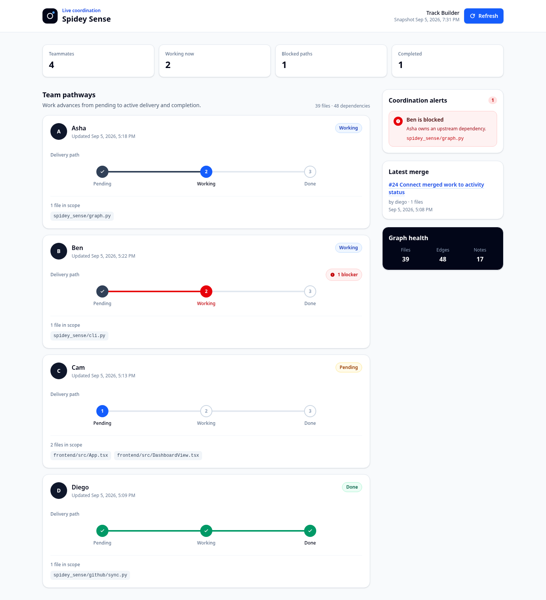
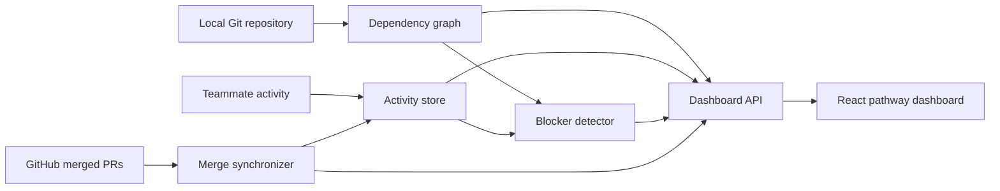

# Spidey Sense

> Dependency-aware coordination radar for teams running AI coding agents in parallel.

Spidey Sense shows what every teammate is working on, how that work moves from
pending to done, and where two active tasks can collide. It combines a repository's
dependency structure with live teammate activity, then presents the result as a
simple pathway dashboard.

The name is intentional: like Spider-Man's early-warning instinct, Spidey Sense
surfaces danger before it lands—in this case, same-file conflicts, dependency
collisions, and work that may block another developer or coding agent.

## Project status

Phases 1 through 5 are implemented and tested end to end.

| Capability | Status |
| --- | --- |
| JavaScript, TypeScript, and Python dependency graph | Complete |
| Local teammate activity tracker | Complete |
| Same-file and dependency blocker detection | Complete |
| GitHub merged-PR synchronization | Complete |
| React pathway dashboard | Complete |
| Optional game-like city reskin | Planned stretch goal |



## The goal

Modern developers often run Claude Code, Codex CLI, and other coding agents in
parallel against the same repository. Each session may look safe in isolation while
quietly depending on—or editing—the work of another session. Spidey Sense creates a
shared, dependency-aware view of that activity so a team can coordinate before
conflicts become expensive merges or duplicated work.

The current version is deliberately local-first:

- Source code and activity data stay on the developer's machine.
- GitHub access uses a token supplied only through an environment variable.
- Every core phase exposes JSON that can be reused by another UI or service.
- The graph, tracker, blocker engine, GitHub adapter, and frontend remain separate
  modules so each can evolve independently.

## How it works



An edge points from the importing file to the dependency it imports. If Alice is
working on the dependency while Bob is working on the importer, Alice is shown as
blocking Bob. Two teammates editing the same file produce reciprocal blocker alerts.

## Quick start

### Requirements

- Python 3.10 or newer
- Git
- Node.js 20 or newer for the dashboard build
- A local Git repository to analyze

The Python core has no third-party runtime dependencies.

### Run the included demo

```bash
git clone https://github.com/Preethesh16/SpideySense.git
cd SpideySense

python -m venv .venv
source .venv/bin/activate
python -m pip install -e .

cd frontend
npm install
npm run build
cd ..

python -m spidey_sense.dashboard \
  --repository . \
  --activity examples/activity.json \
  --github-sync examples/github-sync.json
```

Open <http://127.0.0.1:8765>.

## Typical workflow

Create or update teammate activity:

```bash
python -m spidey_sense.activity set alice working src/app.ts src/api.ts
python -m spidey_sense.activity set bob pending src/core.ts
python -m spidey_sense.activity status bob working
```

Generate a dependency graph and inspect blockers directly:

```bash
python -m spidey_sense . --output graph.json --pretty

python -m spidey_sense.blockers \
  --graph graph.json \
  --activity .spidey-sense/activity.json \
  --pretty
```

Build and serve the dashboard against the live repository:

```bash
cd frontend && npm run build && cd ..

python -m spidey_sense.dashboard \
  --repository . \
  --activity .spidey-sense/activity.json
```

The installed equivalents are `spidey-sense`, `spidey-sense-activity`,
`spidey-sense-blockers`, `spidey-sense-github`, and `spidey-sense-dashboard`.

## GitHub synchronization

Set a personal access token with read access to the target repository, then run:

```bash
export GITHUB_TOKEN="your-token"

python -m spidey_sense.github \
  --repo owner/repository \
  --activity .spidey-sense/activity.json \
  --pretty
```

When a merged pull request overlaps a teammate's active files, Spidey Sense marks
that activity as done. A merge is applied only when it is newer than the activity
snapshot, and the final write uses compare-and-set protection so newly changed work
cannot be completed accidentally.

GitHub logins match teammate names case-insensitively by default. Use
`--identity-map identities.json` when a teammate's local name differs from their
GitHub login.

Tokens are never persisted or included in JSON output. See [Security](SECURITY.md)
for the local trust model.

## Supported dependency syntax

The graph engine recognizes:

- JavaScript and TypeScript static imports, re-exports, dynamic `import()` calls,
  and `require()` calls.
- Python `import` and `from ... import ...` statements, including relative imports.
- Common JS/TS extensions and directory `index` modules.
- Python layouts rooted at the repository root or under `src/`, `python/`, or `lib/`.

Only imports that resolve to supported files inside the repository become edges.
External packages and unresolved local imports remain available as diagnostics.
Git-ignored files are excluded from scanning.

## Local API

The dashboard server exposes two same-origin endpoints:

| Endpoint | Purpose |
| --- | --- |
| `GET /api/health` | Lightweight server health response |
| `GET /api/dashboard` | Aggregated graph, activity, blockers, and optional GitHub sync |

Use `--graph graph.json` to serve a prebuilt graph. Without it, the dependency graph
is rebuilt on each dashboard refresh so current repository changes are reflected.

## Repository layout

```text
spidey_sense/
  activity/       Local JSON activity store and CLI
  blockers/       Dependency-aware conflict detection
  dashboard/      Aggregate API and static dashboard server
  github/         GitHub REST client and merge synchronizer
  graph.py        JS/TS and Python dependency graph engine
frontend/         React, TypeScript, Tailwind CSS dashboard
examples/         Populated local demo data
tests/            Python unit and integration tests
docs/             Architecture, schemas, roadmap, and integrations
```

## Documentation

- [Architecture](docs/architecture.md)
- [JSON data contracts](docs/data-contracts.md)
- [Roadmap and phase history](docs/roadmap.md)
- [Entire CLI and Entire Graph compatibility](docs/entire-compatibility.md)
- [Contributing](CONTRIBUTING.md)
- [Security](SECURITY.md)

## Verification

```bash
python -m unittest discover -s tests -v

cd frontend
npm run typecheck
npm test
npm run build
npm audit --omit=dev
```

The current test suite covers graph resolution, concurrent activity updates,
blocker directionality, GitHub pagination and retries, stale-write protection,
dashboard aggregation, HTTP serving, and React rendering/error states.

## Scope and current limitations

- Activity is currently entered through the CLI or a JSON file; automatic live
  agent-session ingestion is an adapter opportunity.
- Dependency parsing is intentionally focused on JavaScript, TypeScript, and Python.
- Blockers represent coordination risk, not a claim that work must literally stop.
- GitHub synchronization is pull-based and local; no webhook service is required.
- The dashboard is a clean pathway view. The optional city-style visualization is
  not part of the current release.

## License

Spidey Sense is available under the [MIT License](LICENSE).
