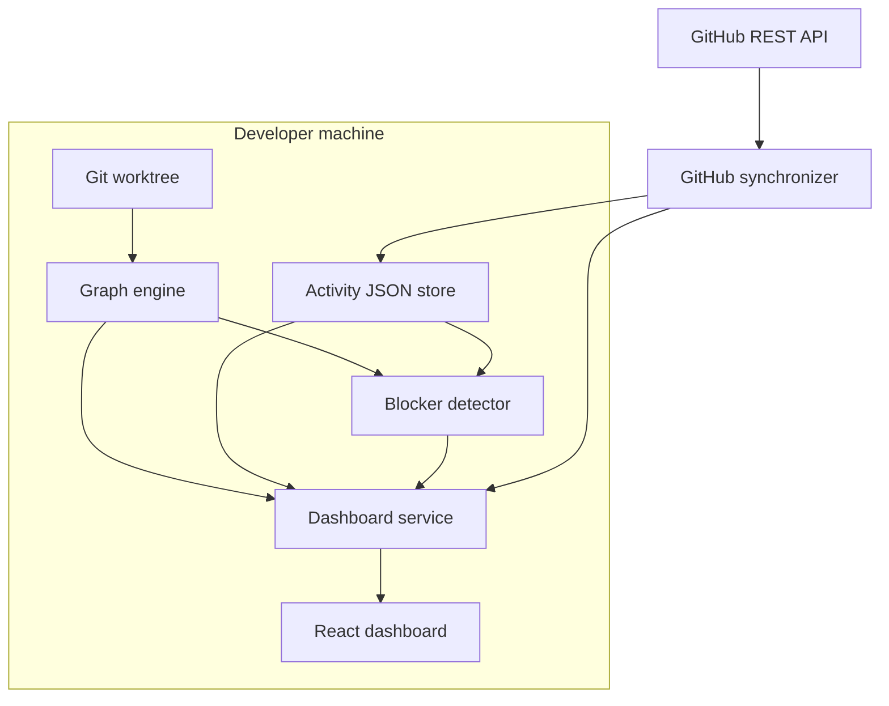

# Architecture

Spidey Sense is a local-first coordination system built as five composable layers.
Each layer consumes and emits plain Python objects or JSON, allowing the dashboard
to be replaced without rewriting the graph and blocker logic.

## System boundaries

The only component that needs network access is the optional GitHub synchronizer.
Repository analysis, activity storage, blocker detection, API serving, and the UI
all operate locally.

## Components

### Dependency graph engine

`spidey_sense/graph.py` identifies the Git root, asks Git for tracked and non-ignored
files, parses supported source files, resolves local import specifiers, and returns
a graph with nodes, directed edges, diagnostics, and summary counts.

Git remains the source of truth for scan scope. Generated folders and other ignored
content do not enter the graph.

### Activity tracker

`spidey_sense/activity/` stores one current record per teammate. Updates are written
atomically through a temporary file and replacement. POSIX file locking protects
parallel writers, and conditional updates prevent a slow integration from replacing
a newer human or agent update.

The store is current-state coordination data, not a historical event log.

### Blocker detector

`spidey_sense/blockers/` joins working activity records to graph nodes. It emits:

- a directed dependency blocker when one teammate edits a dependency of another
  teammate's active file; and
- two directed same-file blockers when separate teammates edit the same file.

Duplicate graph edges and repeated file matches are normalized so the output remains
stable for consumers.

### GitHub synchronizer

`spidey_sense/github/` uses the GitHub REST API to inspect merged pull requests,
changed files, and commits. It supports pagination, bounded retry/backoff, GitHub
Enterprise API roots, identity mapping, and Entire checkpoint trailer extraction.

The synchronizer marks overlapping teammate activity done only if the merge time is
not older than that activity and the activity has not changed before persistence.

### Dashboard service and frontend

`spidey_sense/dashboard/` assembles the latest graph, activity, blockers, and optional
GitHub result at request time. Its small HTTP server exposes the aggregate payload and
serves the production React application from `frontend/dist` on the same origin.

The React application renders one path per teammate with Pending, Working, and Done
checkpoints. A blocker colors the affected path segment red and provides an accessible
tooltip describing the teammate and file relationship responsible.

## Runtime data flow

1. A teammate or local adapter writes activity to `.spidey-sense/activity.json`.
2. The dashboard request triggers repository graph generation, unless a prebuilt
   graph was configured.
3. The blocker detector cross-references current working files with graph edges.
4. The server returns a single dashboard payload.
5. The React client renders paths, blocker alerts, graph health, and merge details.
6. An optional GitHub synchronization run can mark matching activity done; the next
   dashboard refresh reflects that change.

## Design decisions

### Local-first operation

Source structure and activity can be sensitive. Spidey Sense needs no hosted backend
for its current feature set and binds to loopback by default.

### JSON at every integration boundary

CLI users, future adapters, and the frontend share versioned schemas. This keeps the
system inspectable and makes it possible to introduce a different visual client,
file watcher, or session provider independently.

### File-level coordination

Files are the common denominator shared by source imports, editor activity, GitHub
pull requests, and coding-agent sessions. Symbol-level providers such as Entire Graph
can later enrich this model without invalidating its file-level fallback.

### Explicit blocker direction

For `source imports target`, the teammate changing `target` is considered the blocker
and the teammate changing `source` is considered blocked. This captures the likely
direction of coordination while keeping the raw dependency attached for explanation.

## Extension points

- Activity adapters can translate editor events or agent session APIs into the
  existing activity store schema.
- Graph providers can translate higher-fidelity symbol graphs into file edges.
- Source-language parsers can add nodes and edges without changing blocker logic.
- A hosted or streaming API can implement the same dashboard response contract.
- New visual skins can consume the current API without changing backend modules.

See [Data contracts](data-contracts.md) for the schemas and
[Entire compatibility](entire-compatibility.md) for the first planned adapters.
