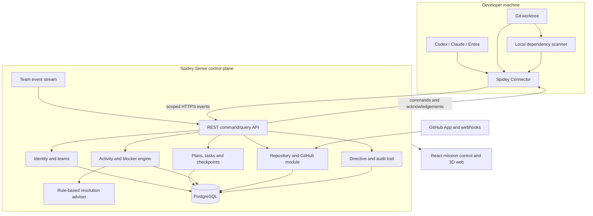

# CP-001 — Collaborative platform architecture

- **Status:** Enabled / completed on `progress`
- **Type:** Architecture baseline
- **Promotion target:** `main`, only after owner approval
**Product stage:** MVP architecture with an upgrade path to a hosted team product

## Checkpoint outcome

This checkpoint aligns the existing local Spidey Sense prototype with the intended
product: a gamified collaboration platform where two or more people connect their
Codex, Claude Code, or compatible coding sessions; create a shared implementation
plan; divide work; observe progress and dependency blockers; correlate activity with
Git and GitHub; and resolve coordination problems through an explainable visual web.

The existing repository already proves several foundations:

- file-level JavaScript, TypeScript, and Python dependency graphs;
- teammate activity and mission states;
- same-file and dependency blocker detection;
- Git and GitHub observations;
- Codex, Claude, and Entire session discovery;
- directives with an allowlisted direct Codex adapter;
- a responsive React and Three.js mission-control interface.

The next product stage turns those local components into team-aware platform
capabilities without discarding the working local-first core.

## Product experience

1. A user signs in and creates or joins a team.
2. The team connects a GitHub repository.
3. Each developer installs and authorizes a local **Spidey Connector** for a specific
   repository and selected coding tools.
4. A planner creates a project plan, milestones, tasks, dependencies, checkpoints,
   and assignments.
5. The platform maps plan tasks to teammates, agent sessions, files, branches,
   commits, pull requests, and dependency nodes.
6. The live web shows what is queued, active, blocked, completed, conflicting, or
   merged.
7. A user opens a danger signal to see its concrete evidence and recommended human
   actions.
8. Authorized users may update assignments or send a narrow, audited instruction to
   a supported coding session.
9. Completed checkpoints can be reviewed and promoted from `progress` to `main`.

## Architecture context and assumptions

- Initial teams contain approximately 2–20 active participants.
- The first goal is an MVP, not enterprise scale.
- Near-real-time means a few seconds, not hard real-time guarantees.
- A repository and its agent sessions may contain sensitive information.
- Local source code should not be uploaded by default.
- The platform receives structured metadata, dependency summaries, file paths,
  statuses, and explicitly approved excerpts—not unrestricted machine access.
- GitHub is the first remote source-control integration.
- Codex and Claude Code are the initial coding-agent providers; Entire remains an
  optional enrichment provider.
- Existing JSON schema 1.0 stays supported during the transition.

## Chosen system shape

Use a **modular monolith control plane**, a **local connector per developer/worktree**,
and a **React web client**.

The control plane begins as one deployable application with strict internal module
boundaries. It must not begin as microservices. The modules can be extracted later
only when scale, reliability, or team ownership proves the need.

## Major modules

### Identity and teams

- user sign-in;
- create team, invite member, join team, leave team;
- roles: owner, planner, member, viewer;
- original spider-themed runner persona/avatar selection;
- repository-level and directive-level permissions.

The avatar system must use original characters and artwork such as Web Scout, Neon
Weaver, Circuit Crawler, or Shadow Spinner. Do not use copyrighted Spider-Man names,
costumes, logos, or character artwork unless the project obtains a license. The
`Spidey Sense` product name should receive a trademark review before commercial use.

### Repository integration

- connect a GitHub repository through a GitHub App for the hosted product;
- maintain repository identity, default branch, connected worktrees, and graph
  snapshot version;
- receive push, pull-request, review, merge, and check-run webhooks;
- reconcile webhooks with periodic reads so missed delivery is recoverable;
- keep the current personal-access-token CLI adapter for local/demo mode only.

### Spidey Connector

- installed locally and paired to one user/team/repository;
- observes only explicitly approved repositories and providers;
- emits heartbeats, normalized session state, file activity, dependency snapshots,
  and Git metadata;
- receives only narrow typed commands such as acknowledge directive or deliver a
  provider-supported message;
- never exposes arbitrary remote shell execution;
- stores credentials in the operating system credential store when available;
- batches and retries events while offline;
- shows a clear paused/disconnected state;
- allows the developer to inspect what will be sent.

The connector is a deterministic monitor/adapter, not an autonomous LLM agent. An AI
assistant may later analyze already-authorized platform data, but it must not become
the trust boundary for data collection or command execution.

### Planning and checkpoints

- create a plan from structured human input;
- divide the plan into milestones and work items;
- assign owners and optional coding sessions;
- connect tasks through prerequisite relationships;
- attach files, directories, or graph nodes to work items;
- statuses: planned, ready, active, blocked, review, done, cancelled;
- create checkpoint acceptance criteria;
- record evidence and owner approval;
- map checkpoint promotion to the two-branch workflow.

AI-assisted plan decomposition is optional and must produce a draft for human
approval. The human plan remains the source of truth.

### Coordination and conflict engine

- preserve current same-file and directed dependency blockers;
- add task-dependency blockers;
- add Git divergence, overlapping pull request, merge conflict, and stale-base
  signals;
- connect every signal to evidence: files, edges, commits, tasks, or PRs;
- calculate severity through documented deterministic rules;
- deduplicate repeated evidence into one incident;
- track lifecycle: open, acknowledged, mitigating, resolved, dismissed;
- record who resolved or dismissed the signal and why.

### Resolution adviser

Begin with rule-based recommendations:

- coordinate ownership;
- wait for an upstream task;
- rebase or update the base branch;
- split overlapping files;
- run targeted tests;
- review a changed contract;
- merge a prerequisite first.

An LLM-based adviser may later summarize evidence or draft a resolution plan. It must
label suggestions as advice, cite the underlying evidence, require human approval for
mutations, and never auto-merge or execute arbitrary commands.

### Visualization and gamification

- Team Lobby: connected runners, personas, provider health, and repository status.
- Plan Web: milestones, tasks, assignments, prerequisites, and checkpoint gates.
- Spidey Tracker: live session activity and mission pathways.
- Dependency Web: repository directory zones, nodes, and import strands.
- Danger Center: blocker evidence, severity, owner, and resolution actions.
- GitHub Timeline: commits, pull requests, checks, reviews, conflicts, and merges.
- Checkpoint Chamber: acceptance evidence and `progress` to `main` promotion state.

Gamification should improve comprehension and motivation. Points, badges, animations,
or personas must never hide engineering truth, encourage unsafe merging, or rank
developers by private productivity metrics.

## Initial data model

| Entity | Essential fields |
| --- | --- |
| User | id, identity provider, display name, persona, preferences |
| Team | id, name, owner, created_at |
| TeamMember | team_id, user_id, role, joined_at |
| Repository | id, team_id, provider, owner/name, default_branch, installation_id |
| Connector | id, user_id, repository_id, version, capabilities, state, last_seen |
| AgentSession | id, connector_id, provider, external_session_id, status, summary, model, timestamps |
| Plan | id, repository_id, title, goal, status, created_by, version |
| Milestone | id, plan_id, title, order, status |
| WorkItem | id, milestone_id, title, description, status, priority, acceptance criteria |
| Assignment | work_item_id, member_id, session_id, assigned_at |
| WorkDependency | predecessor_id, successor_id, dependency_type |
| Checkpoint | id, plan_id, number, title, state, branch_from, branch_to, approval |
| FileActivity | session/member, repository path, activity state, observed_at |
| GraphSnapshot | repository_id, commit_sha, schema_version, stats, created_at |
| GraphNode/Edge | snapshot, path/language or source/target/kind/evidence |
| GitEvent | repository_id, type, branch, sha, actor, files, occurred_at |
| PullRequest | provider id, branches, status, checks, mergeability, files |
| Blocker | type, severity, blocking/blocked subjects, evidence, lifecycle state |
| Directive | sender, target, message, provider, status, timestamps, error |
| AuditEvent | actor, action, target, result, metadata, occurred_at |

PostgreSQL is the source of truth for shared team state. Large graph snapshots may
start as compressed JSON linked from PostgreSQL; normalize them only when query
patterns prove the need. Redis, a message broker, and separate graph databases are
deferred until measured load requires them.

## API and event boundaries

Use HTTPS REST endpoints for commands, initial queries, connector ingestion, and
reconciliation. Use a server-sent event stream for near-real-time team updates in the
MVP. WebSockets may replace or complement SSE only if bidirectional interactive needs
become substantial.

Every connector event includes:

- immutable event ID for idempotency;
- team, repository, connector, and session identity;
- event type and schema version;
- observed timestamp and connector sequence;
- minimal authorized payload;
- graph/commit version when applicable.

The server rejects cross-team identifiers, deduplicates event IDs, tolerates
out-of-order observation timestamps, and derives current projections for the UI.

## Conflict evidence hierarchy

From strongest to weakest:

1. detected Git merge conflict or GitHub mergeability conflict;
2. same-file concurrent active edits;
3. overlapping active pull-request files;
4. directed dependency relationship between active files;
5. explicit task prerequisite not yet completed;
6. advisory inference from an optional AI model.

The UI must show the evidence class and must not present advisory inference as a
confirmed conflict.

## Security and privacy baseline

- Explicit pairing and repository scopes for connectors.
- Short-lived, revocable connector credentials.
- TLS for remote transport.
- GitHub App installation tokens instead of shared user tokens.
- Least-privilege GitHub permissions and webhook signature validation.
- Encryption at rest for stored credentials and secrets.
- Role checks for plans, assignments, directives, and repository settings.
- Immutable audit entries for sensitive control actions.
- Configurable retention and deletion for session summaries and file metadata.
- No source contents by default; upload requires a separate explicit scope.
- No chain-of-thought, private transcript scraping, or keylogging.
- No arbitrary remote command execution.
- Directive text is always a value in a typed provider command, never shell syntax.
- Rate limiting, input limits, schema validation, and connector version checks.
- Team isolation tests are mandatory before hosted beta.

## Two-branch delivery model

- `progress` is the only active development/integration branch.
- `main` represents stable owner-approved checkpoints.
- New checkpoint work is committed to `progress`.
- A checkpoint moves to `main` only after its acceptance criteria and full validation
  pass and the owner explicitly approves promotion.
- The platform should eventually visualize this branch policy and warn when work is
  based on a stale `main` or conflicts with current `progress`.

## Delivery phases after this checkpoint

### CP-002 — Team and plan domain

- team, member, role, repository, plan, milestone, work item, assignment,
  dependency, and checkpoint contracts;
- migrations/storage abstraction;
- deterministic plan visualization fixture;
- backward-compatible local/demo mode.

### CP-003 — Connector protocol

- pairing flow;
- connector/event schemas;
- idempotent ingestion;
- heartbeat/provider health;
- privacy preview and pause controls.

### CP-004 — Live collaborative visualization

- Team Lobby, Plan Web, and combined repository/activity views;
- SSE updates;
- presence and disconnect states;
- original persona/avatar system.

### CP-005 — GitHub App and conflict center

- GitHub App installation and signed webhooks;
- PR/check/review/merge projections;
- conflict incident lifecycle;
- rule-based resolution guidance.

### CP-006 — Directive adapters and hardening

- scoped provider messaging;
- audit and role enforcement;
- privacy/retention controls;
- team isolation, abuse, accessibility, and load testing.

## Acceptance criteria for CP-001

- [x] Product vision aligns team joining, CLI connection, planning, assignments,
  progress tracking, blockers, GitHub, and gamified visualization.
- [x] Existing local prototype capabilities are preserved as the technical base.
- [x] Hosted platform boundaries are separated from local connector responsibilities.
- [x] The monitor-versus-autonomous-agent decision is explicit.
- [x] Core domain entities and evidence hierarchy are defined.
- [x] Security and privacy boundaries are defined.
- [x] Two-branch workflow is documented.
- [x] Significant trade-offs have ADRs.
- [x] The next implementation checkpoints are ordered.
- [x] Existing automated tests remain green before commit.

## Validation evidence

Before the checkpoint commit:

- ZIP project Markdown was compared with the local workspace and matched.
- Python suite: 39 tests passed.
- Frontend suite: 6 tests passed.
- TypeScript typecheck passed.
- Vite production build passed.

## Promotion state

This checkpoint is complete on `progress` but intentionally not merged or pushed to
`main`. Promotion requires an explicit owner request.
